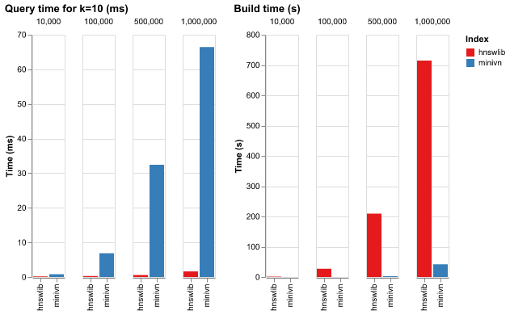

# A Quick Look: minivn vs hnswlib

Here we take a quick look at the performance of the package and compare it with the popular ANN package `hnswlib`. We're not aiming for a precise comparison here; just a rough idea of how they stack up against each other.

## Setup

- Hardware: MacBook Air M1 with 8GB RAM
- Default parameters for `hnswlib` from its [GitHub page](https://github.com/nmslib/hnswlib#python-bindings-examples)
- We're using 768-dimensional Cohere multilingual [Wikipedia embeddings](https://huggingface.co/datasets/Cohere/wikipedia-22-12-en-embeddings). They're similar in size to other popular text embeddings like the ones from OpenAI
- We'll measure the time it takes to search for a single vector and the time it takes to build the index

## Results

As expected, `hnswlib` is much faster when it comes to queries, scaling sublinearly in the document set size. In contrast, `minivn` is slower and scales linearly with just over 50ms for a database of 1,000,000 vectors. However, it is much faster when it comes to the build time, significantly outpacing `hnswlib`. Note that if your embeddings have fewer dimensions (e.g. 256), `minivn` will be more competitive for a larger document set (e.g. by 3x).

Based on these results, the simpler brute force approach could be a better choice if some of the below are true:

- Your document set isn't in the millions
- You're in the experimentation phase and want to iterate quickly on the index
- Your application requires the best recall
- You don't want to fine-tune any hyperparameters (which can affect [ANN performance](https://github.com/erikbern/ann-benchmarks) quite a lot)
