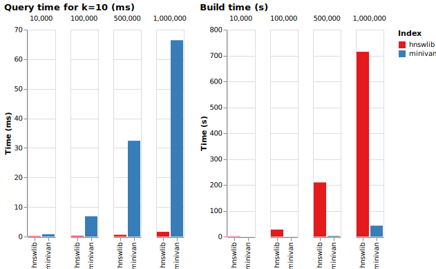

# Quick Look: minivan vs hnswlib

Here we take a quick look at the performance of the package and compare it with the popular ANN package `hnswlib`. We're not aiming for a precise comparison; just a rough idea of how they stack up against each other.

## Setup

- Hardware: MacBook Air M1 with 8GB RAM
- Default parameters for `hnswlib` from its [GitHub page](https://github.com/nmslib/hnswlib#python-bindings-examples)
- We're using 768-dimensional Cohere multilingual [Wikipedia embeddings](https://huggingface.co/datasets/Cohere/wikipedia-22-12-en-embeddings). They're similar in size to other popular text embeddings like the ones from OpenAI or from many SentenceTransformers models
- We'll measure the time it takes to search for a single vector and the time it takes to build the index
- And we'll assume that latency under [50ms](https://web.dev/rail/#response-process-events-in-under-50ms) is the target and under 100ms is acceptable

## Results



- As expected, `hnswlib` is much faster when it comes to queries, scaling sublinearly in the document set size
- In contrast, `minivan` is slower and scales linearly with just over 50ms for a database of 1,000,000 vectors
- However, it is much faster when it comes to the build time. Measuring total time, we start gaining from `hnswlib`'s faster inference after about 5,000-10,000 requests (potentially this could be mitigated by fine-tuning its parameters, but it's not explored here)
- Note that for a given latency, if your embeddings have fewer dimensions (e.g. 256), `minivan` will support a larger document set (e.g. up to 3x larger)

Based on these results, the simpler brute force approach could be a good choice if any of the below apply:

- Your document set isn't in the multiple millions and you don't have ultra-low latency requirements (to accommodate a heavy reranker, for example)
- You're in the experimentation phase and want to iterate quickly on the index
- Your application requires the best accuracy
- You don't want to fine-tune any hyperparameters (which can affect [latency/recall trade-off](https://github.com/erikbern/ann-benchmarks) quite a lot)

## Replication
To replicate, clone the repository and run

```
poetry install --with benchmark
python download_embeddings.py
python benchmark.py
python visualise.py
```

The exact values are saved in `assets/results.jsonl`
